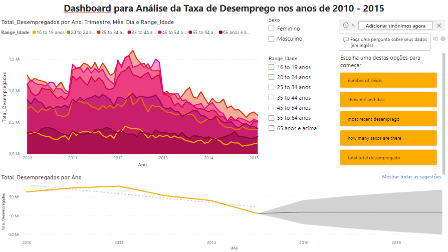

# Dashboard para Análise da Taxa de Desemprego nos anos de 2010 - 2015

O objetivo deste projeto é aplicar os conceitos de Séries Temporais para análisar e criar um dashboard interativo à respeito da taxa de desemprego nos anos de 2010 até 2015 com os dados do nosso dataset.

### Resultado

