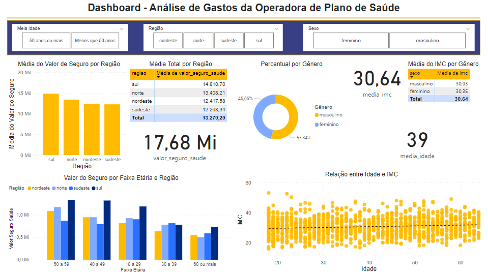

# Análise de Gastos da Operadora de Plano de Saúde

O objetivo deste projeto é realizar uma análise sobre os gastos da operadora de Plano de Saúde, para isso  iremos responder algumas perguntas:

1. Qual o gasto total da operadora?
2. Qual a idade média dos usuários da operadora?
3. Qual o gasto médio por região?
4. Qual faixa etária possui maior gasto com seguro saúde por região?
5. O aumento da idade influencia no imc?
6. Quem tem maior gasto, homens ou mulheres?
7. Se o usuário for mulher, o imc é acima ou abaixo da média?
8. Se  for  homem,  com  mais  de  50  anos  e da  região  Sudeste,  o  gasto  é maior ou menor que a média de gastos da região?

### Resultado

