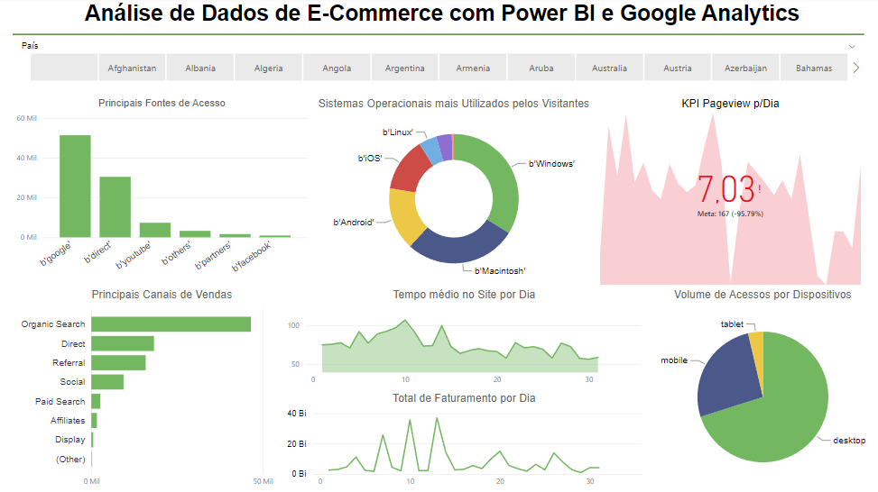

# Análise de Dados de E-Commerce com Power BI e Google Analytics

O objetivo deste projeto é realizar uma análise sobre as informações obtidas a partir do Google Analytics extraídas de uma determinada loja. Informações sobre:

* Principais fontes de acesso;
* Sistemas Operacionais mais utilizados;
* Principais canais de vendas;
* Volume de acessos por dispositivos;

Vamos agrupar as informações por país para o que o gestor possa ter um detalhamento sobre como é o comportamento dos seus clientes para cada país.

### Resultado

