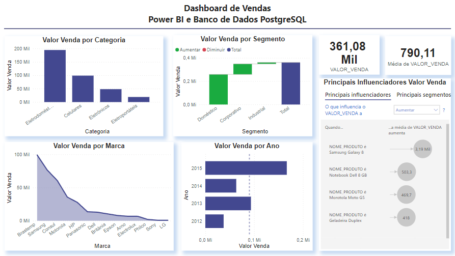

# Dashboard de Vendas
## Power BI e Banco de Dados PostgreSQL

O objetivo deste projeto é realizar uma análise geral de vendas com base nos dados extraídos de diversas tabelas a partir de um banco de dados relacional. O banco de dados utilizado foi o PostgreSQL.

### Resultado

